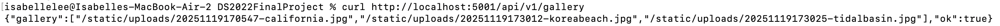
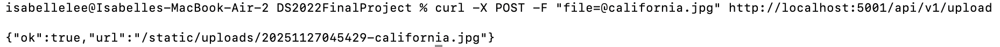

# DS2022FinalProject

## 1) Executive Summary
### Problem
When brainstorming ideas on what to do, one came to mind: a travel diary. I enjoy traveling and taking photographs to document my experiences; however, sometimes I find that I lose the photos I take. I wanted to combine my hobby into my project, while receiving the opportunity to find a solution for my problem. While my project was based on my own problems, my app can help travel enthusiasts alike who have similar issues to mine.

### Solution
I wanted to keep my travel diary simplistic and minimalistic; going into the project, I wanted an area of the web page that displayed all the pictures I uploaded. This gallery style would enable me to keep all of my travel photography in one space, making it easier to track my travels. I based my general project off of Case 07, the Lanternfly Tracker. I was heavily inspired by the concepts from that case and used what I learned from it to create my own project. Additionally, with some assistance from ChatGPT and my own imagination, I got creative when playing around with HTML and CSS; I styled my app in a way that reminded me of a scrapbook, playing into the whole “diary” aspect of my project.

## 2) System Overview
* Course Concept: The specific module concept I used was Flask API.
* Architecture Diagram:
* Data/Models/Services: Users are able to upload their own images, ranging in size and format (JPG or PNG). The background of the web app itself is an svg file that I created myself on Canva that contains free-to-use graphic elements. Python packages used include Flask, Werkzeug, and python-dotenv. I also created an Azure storage blob, though my app ultimately ended up storing images locally.

## 3) How to Run (Local)
### How to Run Locally with Docker

```bash
# Build the Docker image
docker build -t ds2022finalproject .

# Run the container
docker run -p 5001:5001 --name ds2022finalproject ds2022finalproject

# Check your app in the browser
# Open: http://localhost:5001

# Test the API endpoints with curl
curl http://localhost:5001/api/v1/gallery
curl -X POST -F "file=@path/to/your/image.jpg" http://localhost:5001/api/v1/upload
```
## 4) Design Decisions
### Why this concept
I chose to use Flask API to create an image gallery because I wanted to create a scrapbook, but in digital form. I took inspiration from Case 07, which is where I first learned about Flask API and its advantages in handling file uploads. The difference between the app made in Case 07 and my app is the use of local file storage rather than Azure Blob Storage. I found it simpler to use local file storage, and it prevented headaches at times. Additionally, local file storage was helpful in saving uploaded images even when the container was stopped and restrated. I could’ve alternatively used Azure Blob Storage, like Case 07 did, but I ran into some different issues while progressing through my project; I started off with using Azure Blob Storage before I found it easier to use local file storage instead.

### Tradeoffs
Since my app uses Flask, there’s a tradeoff when handling larger images; however, it handles well with images on a smaller scale. I personally haven’t run into many problems. My app also runs locally, which doesn’t have added costs. Regardless, its deployment on Azure would require credit. I also created a container through Docker which did add a layer of complexity; however, the container enables for more consistency, isolation, and efficiency. Nevertheless, the biggest tradeoff I experienced when using Docker to develop my app was the need to rebuild my container everytime I edited HTML and CSS. I edited these files several different times, so it did get repetitive when rebuilding and rerunning my container every time.

### Security
My app didn’t require any external secrets or API keys since everything was created locally. I didn’t have to worry about sensitive data. Regarding input validation, users are only able to upload images, which is the only validated upload type. This allows protection against unvalidated upload types or malicious uploads. Again, since there weren't any API keys or other private elements, no personally identifiable information is used or stored by my app. Additionally, uploaded images don’t reveal anything personal about the user.

### Ops
Container logs are visible when the container is started and running with the use of the Docker command. I am able to monitor uploads and see that my requests are processing and if uploads are working. When considering scaling, the app is designed locally in a single container. Scaling to multiple users or containers may require more than just local file storage, and I would have to consider using Azure Blob Storage instead. Additionally, a limitation that I discovered was the need to rebuild my container evertytime I updated my HTML and CSS files. I discussed this in the tradeoff portion.

## 5) Results & Evaluation
### Screenshots




